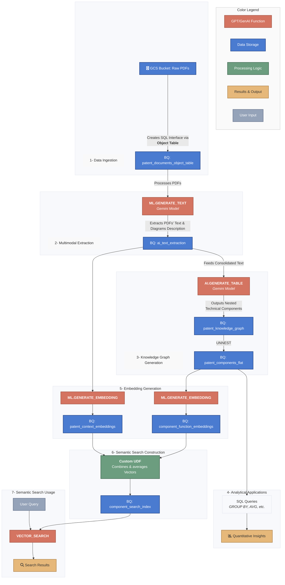

# AI Patent Analyst: Application Diagrams

This file contains the architectural and workflow diagrams for the "AI Patent Analyst 2.0" project.

---

## Workflow Overview

This diagram illustrates the end-to-end data flow, from ingesting raw patent PDFs to generating the final AI-powered analysis.

